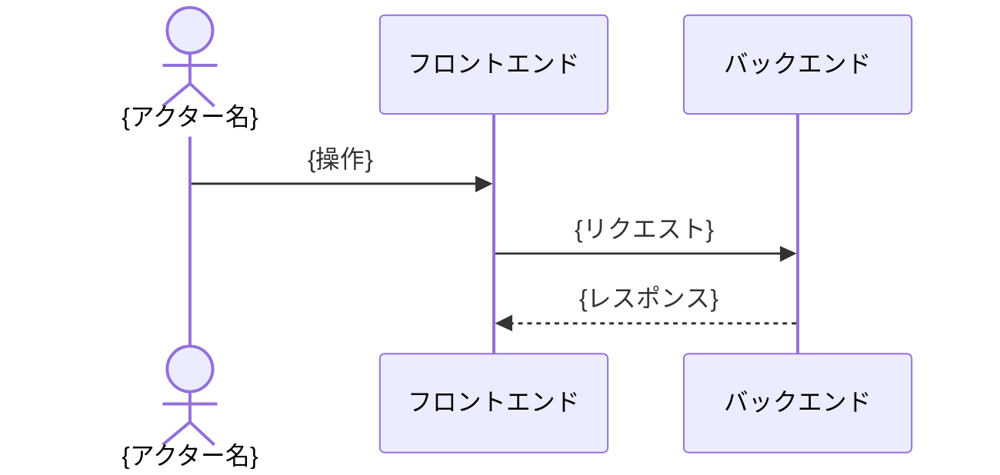

# {ユースケース名}

## 概要

{このユースケースが何をするかを 1〜2 文で}

## アクター

- {アクター名}（例: 購入者、管理者、外部決済サービス）

## 事前条件

- {このユースケースが成立するために必要な状態}

## フロー

<!--
任意セクション。記載基準を満たさない場合はセクションごと削除する。基準は SKILL.md「フローセクションの記載基準」を参照。
-->

## 受け入れ基準

**正常系: {条件}の場合、{期待結果}となること**

- Given: {前提となるシステム状態・データ状態}
- When: {ユーザーまたはシステムが行う操作・イベント}
- Then: {期待されるシステムの振る舞い・状態変化}

**異常系: {条件}の場合、{期待結果}となること**

- Given: {前提状態}
- When: {操作・イベント}
- Then: {エラー応答・状態の変化}

## 備考（任意）

<!--
任意セクション。書くべき補足が無い場合はセクションごと削除する。
何を書き何を書かないかは guidelines.md 9 を参照。
-->

{制約・ビジネスルールなどを箇条書きで記載}
